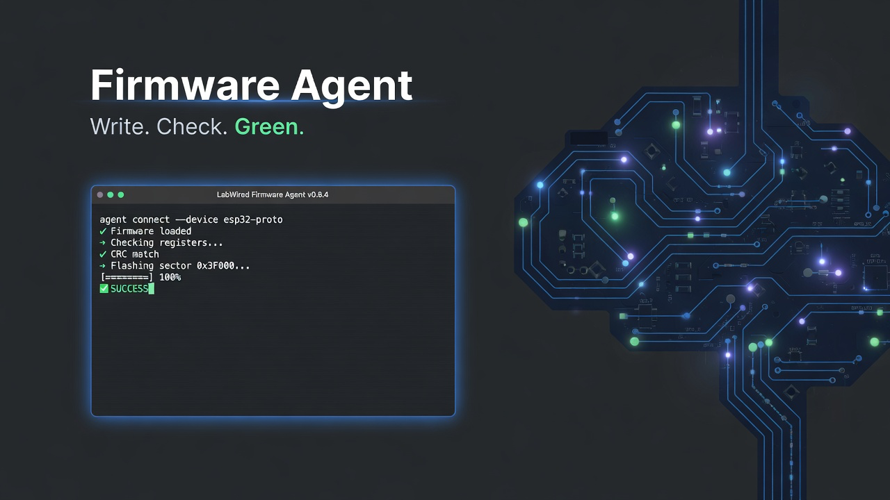

# LabWired Firmware Agent — the easiest way to write firmware

<p align="left">
  
</p>

<p align="center">
  <a href="https://labwired.com/agent.html"></a>
</p>

An AI agent that writes firmware and checks it on a virtual board before you
touch hardware. Free. Open source. Works with a local model, or with Claude /
Codex.

**Product page:** [labwired.com/agent.html](https://labwired.com/agent.html) · live **Write → Check → Fix → Green** demo

[](LICENSE)
[](CHANGELOG.md)
[](#install)

## Install

**One command** (recommended):

```bash
curl -fsSL https://labwired.com/agent-install.sh | sh
labwired doctor
labwired
```

npm:

```bash
npm i -g @labwired/agent
labwired doctor
labwired
```

From git:

```bash
git clone https://github.com/LabWired/agent && cd agent
./install.sh
labwired
```

Already on Claude or Codex? Skip the agent shell and connect LabWired:

```bash
claude mcp add labwired --transport http https://api.labwired.com/mcp
codex mcp add labwired --url https://api.labwired.com/mcp
```

Simulator (for full on-device-style checks on the twin):

```bash
curl -fsSL https://labwired.com/install.sh | sh
```

## What it does

1. You describe the board and the job  
2. The agent writes firmware  
3. It runs that firmware on a digital twin of the chip  
4. You get a green result only when the behavior matches  

No “looks fine in the source” passes.

## Product line

| Product | What you get |
|---------|----------------|
| **Firmware Agent** (this) | Free CLI agent + skills + twin check |
| **[Pro](https://labwired.com/pro.html)** | Private projects, priority builds, editor workbench |
| **Enterprise** | Air-gap, on-prem model, vault | Talk to us on the site |

Packaging plan: [docs/PRODUCT.md](docs/PRODUCT.md).

## Skills

| Skill | What it’s for |
|-------|----------------|
| `verify-firmware` | Run the check; report only what the twin says |
| `diagnose-firmware` | Fail first, fix, check again |
| `inspect-evidence` | Explain a result without inventing details |
| `board-bringup` | Pick a board and wire a valid setup |
| `scaffold-firmware` | Minimal blink or serial “hello” |
| `report-evidence` | Clear report for you or CI |

## Commands

| Command | Purpose |
|---------|---------|
| `labwired` | Start the agent |
| `labwired doctor` | Check install |
| `labwired version` | Version info |
| `./demo.sh` | Offline smoke + Gate 1 demo |

```bash
ollama pull qwen2.5-coder && ollama serve   # optional local model
labwired
```

## Air-gapped

```bash
curl -fsSL https://labwired.com/agent-install.sh | sh -s -- --airgap
# or: ./install.sh --airgap
```

See [mcp/README.md](mcp/README.md).

## Demo

Red → green check story: [fixtures/gate1/GATE1.md](fixtures/gate1/GATE1.md).

```bash
./demo.sh
```

## Links

- Site: [labwired.com](https://labwired.com)  
- Pro: [labwired.com/pro.html](https://labwired.com/pro.html)  
- Playground: [app.labwired.com](https://app.labwired.com/)  
- Changelog: [CHANGELOG.md](CHANGELOG.md)  

MIT — [LICENSE](LICENSE).
