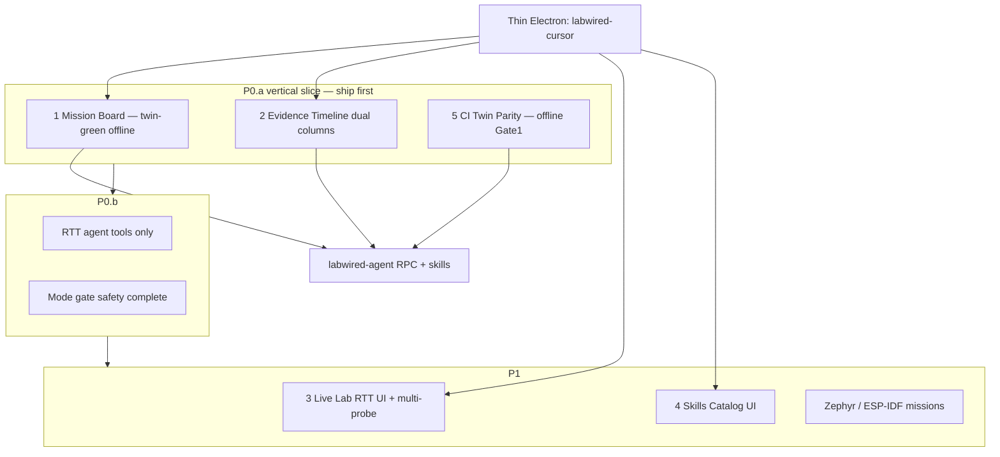
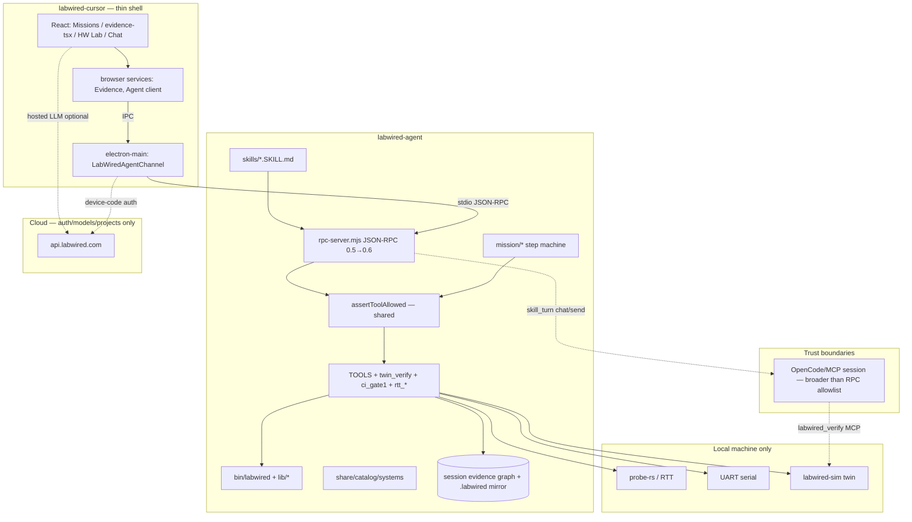
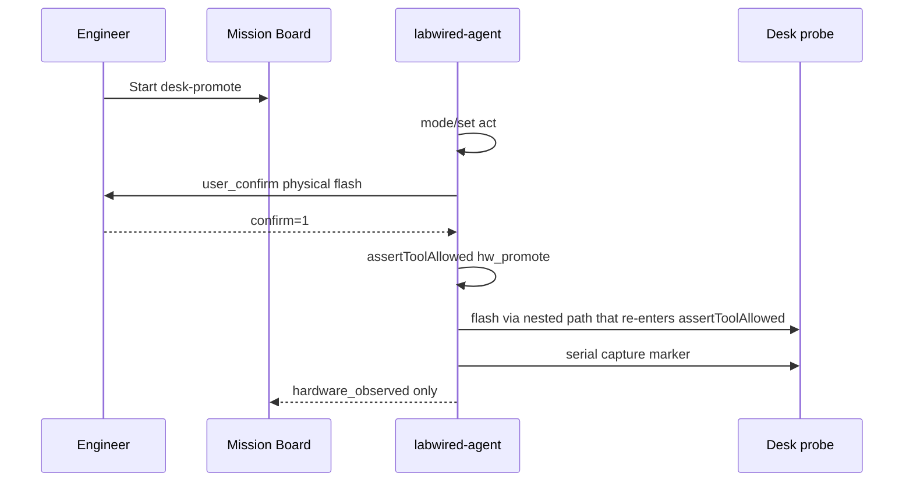
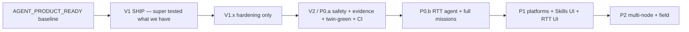
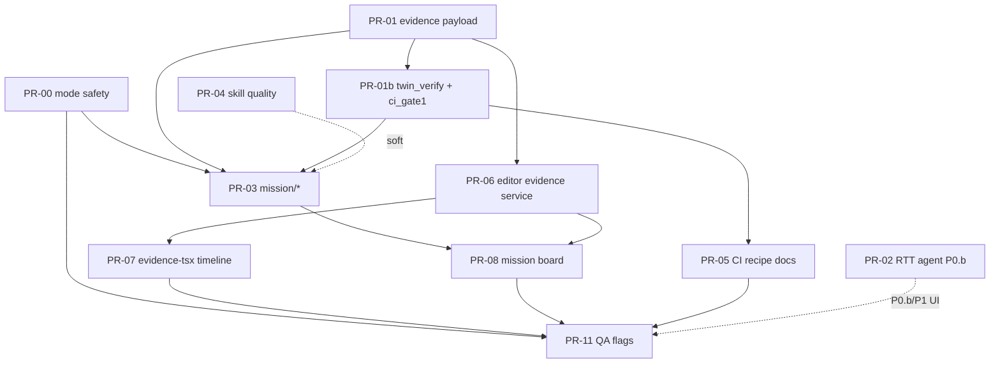

# LabWired SOTA Firmware Engineer Platform — Product Design

| Field | Value |
|-------|-------|
| **Title** | LabWired SOTA Firmware Engineer Platform — Product Design |
| **Author** | LabWired Product / Systems Architecture |
| **Date** | 2026-07-31 |
| **Status** | Approved (rev 3 — **V1 ship-first** rule binding) |
| **Repos** | `labwired-cursor` (thin Electron editor), `labwired-agent` (JSON-RPC runtime) |
| **Baseline claim** | `AGENT_PRODUCT_READY` (scoped) — `docs/superpowers/plans/2026-07-31-agent-product-ready.md` |
| **V1 ship rule** | **Binding:** `docs/superpowers/plans/2026-07-31-v1-ship-what-we-have.md` — ship only super-tested baseline first |
| **Related specs** | `2026-07-30-thin-agent-runtime-design.md`, `2026-07-30-hw-lab-surfaces-design.md` |
| **Revision** | rev 2 design review + rev 3: SOTA is roadmap; **first ship = V1 tested surface** |

---

## Overview

Firmware engineers still work as if 2015 never ended: flash → open a serial terminal → scroll logs → guess. Generic AI IDEs generate C without hardware proof. Vendor IDEs flash and debug by hand. Neither path is **evidence-native**. LabWired’s north star is an **evidence-native agent for firmware**: plan and code against a digital twin, earn `model_verified` only from oracle dispose, then promote to the desk as `hardware_observed` — and never confuse the two.

This document defines the **long-term** product offering (SOTA). It is **not** the first release plan.

### Ship order (binding)

| Phase | What | When |
|-------|------|------|
| **V1** | What we **already have**, automated-green + honest notes | **First ship** — see `2026-07-31-v1-ship-what-we-have.md` |
| **V1.x** | Hardening only (bugs, safety denylist, tests, docs) | Immediately after V1 |
| **V2 / SOTA P0.a** | Mission board, evidence graph, twin_verify RPC, CI recipe | **After** V1 is trusted |
| **Later** | RTT UI, platform packs, multi-node, field | P0.b / P1 / P2 below |

**Rule:** Do not delay V1 for Mission Board, Evidence Timeline, or RTT.  
**Rule:** Do not market V1 as the SOTA platform.

**Recommended long-term product shape:** Evidence-native missions product (Alternative C). Electron’s Void/Cursor heritage is the **implementation substrate**, not the product identity (see KD-1, Non-Goals).

**Ship bar honesty:** V1 claims **AGENT_PRODUCT_READY** only. Success metrics for SOTA **do not** authorize `FULL_GUI_PRODUCT_READY`.
---

## Background & Motivation

### Product problem

User feeling: *we live in the past.* Polishing 2015 flash/serial loops with a chat chrome is not the future of firmware engineering. Compile+flash is not success. Behavior fails (BF) are real. Agents that invent green claims destroy trust faster than no agent at all.

### Current state (AGENT_PRODUCT_READY, scoped 2026-07-31)

Honest baseline from `labwired-cursor/docs/superpowers/plans/2026-07-31-agent-product-ready.md` and `gap-worklist.md`:

| Layer | What exists today | Evidence |
|-------|-------------------|----------|
| **Runtime** | Thin shell; tools live in `labwired-agent/server/rpc-server.mjs` (protocol `0.5.0`) | Thin-agent-runtime design |
| **Claim vocabulary** | `model_verified` (twin only) vs `hardware_observed` (desk flash+marker) | `config/AGENTS.md`, `hw_claim_shape`, skills |
| **RPC tools** | `debug_*`, `plot_*`, `probe_flash` (`confirm=1`), `hw_claim_shape`, `hw_promote` (dry_run) | `TOOLS[]` in rpc-server — **no twin verify tool yet** |
| **Twin dispose** | MCP `labwired_verify` + skills via `chat/send` / OpenCode; offline fixtures + `assert_status` | Not on RPC `tool/run` today |
| **Mode gates** | Plan blocks subset of destructive tools; Verify allowlist | **`hw_promote` not in Plan denylist; nested flash bypasses `toolRun`** (P0 safety fix) |
| **Skills** | 9 expert skills under `skills/*/SKILL.md` | inventory test only |
| **Editor** | HW Lab Demo\|Live, `SerialPlotStrip`, slash, LabWired commands, flash confirm | `browser/react/src/hw-lab-tsx/*` (**source**); `src2/` is generated |
| **Evidence UI** | Editor-local store + **DOM** `evidencePane.ts` + **React** `browser/react/src/evidence-tsx/EvidencePanel.tsx` | Dual UIs; neither is a claim graph; React colors omit `hardware_observed` |
| **Evidence events** | `chat/toolResult` → `{ name, code, detail }` only — **`extra` not forwarded** | Channel + `LabWiredAgentEvent` lack `extra` |
| **Twin Gate1** | Offline + live ESP32-C3 fixtures → `model_verified` | `fixtures/gate1/`, `fixtures/gate1-live/`, `scripts/live-gate1.sh` |
| **Catalog** | **22** system YAMLs | `share/catalog/systems/` |
| **Glass home** | Starters still Plan/Debug/Run/Inspect — not mission objects | Correct elevation target |

**Explicitly not claimed today:**

- Full Electron click E2E
- GDB step / breakpoint UI
- STM32 powered J-Link live read
- Physical flash + serial promote E2E (automation is dry_run)
- RTT/defmt first-class path (skill text allows RTT; **no RPC implementation**)
- Evidence *timeline* / claim graph
- Mission board product surface
- Multi-platform skill depth (Zephyr / ESP-IDF / Arduino as first-class missions)
- CI twin parity recipe as a productized customer PR check

### Known correctness gaps (must fix in P0.a)

These are **code facts**, not vision:

1. **Plan + `hw_promote`:** Plan destructive set is only `probe_flash`, `probe_reset`, `install_deps`, `probe_install_backend`, `debug_gdb_start`. `hw_promote` is missing. Composite promote flashes via nested `runLabwired(expandArgv(probe_flash…))`, **bypassing** `toolRun` mode gates. `confirm=1` still required for physical — but Plan is not a hard “no flash” boundary.
2. **Twin not on RPC:** Real `model_verified` from live twin is MCP/`labwired_verify` or offline fixture assert — not `tool/run`.
3. **Evidence path incomplete:** Special tools return `extra` in RPC response, but `chat/toolResult` notifications drop it; editor ingest misses `hw_*`; store is editor-local (last ~50), not agent-authoritative.

### Pain points

1. **Slash soup** — power users get `/doctor /gdb /promote`; newcomers need *missions*.
2. **Evidence is a list, not a story** — no parent→child claim graph; dual-claim columns not always visible; React panel under-colors HW status.
3. **UART-centric live path** — plot/serial work; RTT/defmt not productized in agent tree.
4. **Skill quality is inventory-checked, not HIL-proven**.
5. **Platform demo vs platform product** — ESP32-C3 canaries strong; Zephyr/ESP-IDF/Arduino mission depth thin.
6. **CI story is offline fixtures** — Gate1 offline assert works; customer “same oracle local + PR” recipe incomplete.

### SOTA research ground truth (design constraints)

External papers are **not in-repo**. Binding takeaways we adopt (not full paper reproduction):

| What we take as binding | Source (external) | In-repo alignment |
|-------------------------|-------------------|-------------------|
| Compile+flash ≠ success; measure **behavior fail (BF)** via oracle | IoT-SkillsBench / arXiv [2603.19583](https://arxiv.org/abs/2603.19583) (2026) | `AGENTS.md`, Gate1, `assert-status` |
| Expert-curated, oracle-grounded skills beat LLM-generated skill dumps | same | skill quality tiers; no generated default skills |
| Twin/sim first in CI; desk promote second | Renode-class multi-node practice (industry) | Gate1, hw-promote ordering |
| Modern observe: probe-rs + RTT/defmt; GDB not product hero | probe-rs ecosystem | debug tools exist; RTT TBD |
| Platform breadth (ESP-IDF, Zephyr, Arduino) | product requirement | catalog 22 systems; skills lag |

**BF (behavior fail):** oracle clause fails or firmware crashes/faults despite compile/flash success. Gate1 broken fixture is the public BF story.

---

## Goals & Non-Goals

### Goals

1. **Evidence-native product identity** — every mission ends in typed claims (`model_verified` | `hardware_observed` | `failed` | `inconclusive` | `unsupported`), never chat vibes.
2. **Surfaces ship incrementally** — P0.a proves Mission + Evidence + CI Gate1 (offline) + safety; Live Lab RTT agent in P0.b; Skills Catalog **UI** in P1; full Live Lab RTT UI in P1.
3. **Twin → desk ladder** — default path: plan/code → twin verify → promote; desk never upgrades to twin green.
4. **Skills as product** — curated peripheral×platform catalog with quality gates; P0 backend quality, P1 browse UI.
5. **Modern live path (directional)** — RTT/defmt alongside UART over time; probe-rs-first; **confirm gates + mode gates** for physical flash are hard.
6. **CI parity** — Gate1 recipe: offline claim gate always; live sim optional.
7. **Preserve thin architecture** — Electron renders + approves; `labwired-agent` owns tools; cloud = auth/models/projects only.

### Non-Goals (this design horizon)

| Non-goal | Why |
|----------|-----|
| Full GDB step/breakpoint IDE | RTT/defmt > GDB-as-hero; step UI is P2+ polish (KD-1 + KD-5) |
| Cursor feature-parity as product identity | Substrate only; product chrome is Mission/Evidence/Live Lab |
| Reimplement probe/sim inside React | Violates thin-shell principle |
| Cloud USB / remote probe in P0 | Cloud stays auth/models/projects |
| Auto-upgrade claims or LLM-as-judge | Forbidden by `AGENTS.md` and claim tools |
| Training/fine-tune pipeline as product | Explicitly disallowed |
| Multi-node fleet product in P0 | P2 |
| Cryptographic skill signing in P0 | P0 = in-repo skills path only; signing is P2 |
| Claiming `FULL_GUI_PRODUCT_READY` from this design alone | Explicit honesty bar |

---

## Proposed Design

### Product vision (north star)

> LabWired is the **evidence-native agent for firmware**: plan/code against twin → prove `model_verified` → promote to desk as `hardware_observed` — never confuse the two.

### Differentiation

| | Generic AI IDE | Vendor IDE | **LabWired** |
|--|----------------|------------|--------------|
| Code | AI edits without HW proof | Manual write | AI + skill procedures |
| Proof | Chat confidence | Human flash/debug | Twin oracle + desk marker |
| Claims | Unstructured | None | Dual claim vocabulary, tool-enforced |
| Loop | Edit forever | Flash/serial forever | Mission: twin green → desk promote |
| Skills | Generic coding | Board support packages | Expert peripheral×platform + HIL oracles |

### Product surfaces (ship phasing)



| # | Surface | P0.a | P0.b | P1 |
|---|---------|------|------|-----|
| 1 | Mission Board | **Yes** — ≥1 mission (`twin-green` offline assert / Gate1); optional dry desk-promote | Full 5 missions + mode steps | Platform packs |
| 2 | Evidence Timeline | **Yes** — dual columns + structured ingest | Graph parents polish | — |
| 3 | Live Lab | UART/plot as today | — | RTT UI, multi-probe |
| 4 | Skills Catalog | Backend metadata/canaries only | — | **Browse UI** + skill/list |
| 5 | CI Twin Parity | **Yes** — offline recipe + `ci_gate1` | — | Live sim optional job |

#### 1. Mission Board

**Jobs, not slash.** Curated mission templates map to skills and **RPC-first** tools:

| Mission id | User intent | Execution | Success claim | P0.a? |
|------------|-------------|-----------|---------------|-------|
| `twin-green` | Prove behavior on twin | RPC `twin_verify` and/or `assert_status` on Gate1 artifacts; repair via skill-turn in Act | `model_verified` | **Yes** (offline assert path mandatory; live sim if present) |
| `desk-promote` | Flash + marker on silicon | RPC `hw_promote` (Act + confirm) | `hardware_observed` | Dry-run only in P0.a; physical P1 |
| `bringup` | New board / wiring | Skill-turn Plan | diagram validated | P0.b |
| `scaffold` | Blink / serial hello | Skill-turn Act | builds | P0.b |
| `diagnose` | Red twin or red desk | Skill-turn Act + Verify cycles | typed non-pass or fixed green | P0.b |

**UI placement:** Lab home starters + sidebar “Missions” elevate `slashCommands.ts` prompts to Mission objects with progress steps. Slash remains power-user escape hatch.

##### Mission execution engine (KD-13) — critical

Missions **cannot** assume `labwired_verify` is already on RPC (it is not). Chosen model:

| Step kind | How it runs | Claims |
|-----------|-------------|--------|
| **`rpc_tool`** | Server step machine calls internal `assertToolAllowed` + tool implementation (same path as `tool/run`) | Structured `extra.evidence` |
| **`skill_turn`** | `chat/send` with frozen skill prompt + oracle identity; OpenCode/MCP may call `labwired_verify` | Claims only accepted when a subsequent RPC claim tool (`assert_status`, `twin_verify`, `hw_claim_shape`) records them — **never from model prose** |
| **`user_confirm`** | Editor modal; server waits for confirm token | Physical flash |

**Preferred thin-architecture path for twin claims on RPC:**

- Add **`twin_verify`** RPC tool (P0.a): wraps existing sim/Gate1 path (`scripts/live-gate1.sh` / sim test + `assert-status`) with params `{ elf?, oracle?, diagram?, system?, evidence_dir? }` and emits `extra.evidence` with `status: model_verified|failed|…`.
- Offline-only mode: `twin_verify` with `mode=offline_assert` + path to `verify.json` → pure `assert_status` (always works in CI without sim).

**Not allowed:** a second brain that invents `model_verified` inside the mission runner without tools.

##### Mission API authority (KD-14)

| Surface | Role |
|---------|------|
| **`mission/list` · `mission/start` · `mission/status` · `mission/cancel`** | **Authoritative** for all skins (Electron, CLI, VS Code ext) |
| **`mission_run` tool** | Thin wrapper over `mission/start` for `tool/list` / chat discovery only — **not** a second implementation |
| **CLI** | `labwired mission list\|start\|status` → same server handlers (or stdio RPC) |

Step machine lives **only** in `rpc-server.mjs` (or a module it owns). Editor never reimplements steps.

##### Mode policy + per-step modes (KD-15) — critical

**Code bug to fix in P0.a (before Mission Board ships):**

1. Add `hw_promote` (and any future composite flash) to Plan **denylist**.
2. Extract `assertToolAllowed(name, mode)` used by `toolRun` **and** all nested/composite paths (`hw_promote` flash/serial must re-enter this — never raw `runLabwired` without policy).
3. Harness: `MODE-PLAN-01` Plan + `hw_promote` dry_run → fail closed; `MODE-PLAN-02` Plan + non-dry → fail closed; `MODE-PLAN-03` Act + dry_run → ok.

**Mode meanings (server-enforced):**

| Mode | Policy (target after fix) |
|------|---------------------------|
| **Plan** | No flash, no `hw_promote`, no GDB attach, no install_deps |
| **Verify** | Allowlist only: score/assert/`twin_verify`/doctor/probe list/serial_capture/plot/hw_claim/debug_info/smoke/help/version — **no edits, no promote** |
| **Act** | Full tools; physical flash/`hw_promote` need `confirm=1` |
| **Debug** | Evidence-first; prefer read/capture; flash still confirm-gated |

**Per-mission step → mode (server sets mode before step; UI reflects):**

| Mission | Steps | Modes |
|---------|-------|-------|
| `twin-green` | (optional Plan research) → twin dispose → if red: repair skill_turn → re-dispose | Plan? → **Verify** (`twin_verify`/`assert_status`) → **Act** (repair edits) → **Verify** (re-assert) |
| `desk-promote` | confirm → flash+capture → claim | **Act** + `user_confirm` throughout |
| `diagnose` | capture fail → patch ≤3 → re-verify | **Debug**/Act for capture → Act repair → Verify assert |

Mission runner **calls `mode/set` between steps**; implementers must not leave the session in Verify during repair.

#### 2. Evidence Timeline (claim graph)

**Today (accurate):**

- Flat `EvidenceEntry[]` with `guessStatus` string scan (`common/labwiredEvidenceService.ts`) — `hardware_observed` prioritized before `model_verified` in guess order (good).
- DOM pane: `browser/evidencePane.ts` (colors include `hardware_observed`).
- React: `browser/react/src/evidence-tsx/EvidencePanel.tsx` (built via tsup) — **status colors omit `hardware_observed`**; no dual columns.
- Auto-ingest filter: `/score|assert|smoke|verify|doctor/i` — **misses** `hw_claim_shape`, `hw_promote`, flash.
- `chat/toolResult` notification: `{ name, code, detail }` only — **`extra` dropped** even when RPC result has `extra`.
- Store: editor workspace storage, not agent session graph.

**Canonical UI (KD-16):** **`evidence-tsx/EvidencePanel.tsx` is the timeline surface.** DOM `evidencePane.ts` remains a thin host / open-command shell that mounts or delegates to React panel; no third evidence UI. Deprecate divergent DOM list rendering once React timeline ships.

**End-to-end evidence contract (P0.a — blocks Timeline):**

```mermaid
sequenceDiagram
  participant T as tool implementation
  participant R as rpc-server toolRun
  participant C as LabWiredAgentChannel
  participant E as labwiredEvidenceService
  participant U as EvidencePanel

  T->>R: result { code, stdout, extra.evidence }
  R->>R: notify chat/toolResult { name, code, detail, extra }
  R->>R: notify evidence/append { node }
  C->>E: toolResult event with extra
  E->>E: prefer extra.evidence; widen name filter
  E->>U: onDidChange graph
  Note over T,R: Also mirror node to workspace .labwired/evidence/
```

| Layer | Contract |
|-------|----------|
| **Agent tool result** | Always attach stable `extra.evidence` node when claim-relevant; optional always-on for all tools |
| **Notifications** | `chat/toolResult` **must include `extra`**; add `evidence/append` for subscribers |
| **Channel / types** | `LabWiredAgentEvent` toolResult gains `extra?: unknown`; forward from RPC |
| **Editor ingest** | Prefer structured `extra.evidence`; fallback `guessStatus`; filter includes `hw_claim|hw_promote|probe_flash|twin_verify|assert|score|…` |
| **Source of truth (KD-12)** | **Agent session graph authoritative** while agent online; **workspace mirror** `.labwired/evidence/<run_id>/` for CI/reload; editor storage is cache of mirrored nodes. Offline agent → editor shows last mirror + read-only drafts |

**Evidence node schema** (own schema file — **not** `fixtures/trajectories/schema.json`, which is episode/QLoRA collection):

Path: `labwired-agent/share/evidence/schema.json` (or `fixtures/evidence/schema.json`).

```json
{
  "evidence_id": "ev_…",
  "parent_ids": ["ev_…"],
  "mission_run_id": "mr_…",
  "path": "twin|hardware|install|debug|ci",
  "status": "model_verified|hardware_observed|failed|inconclusive|unsupported|pending|refused",
  "tool": "assert_status",
  "oracle_ref": "…",
  "artifact_refs": ["verify.json", "uart.log"],
  "ts": "ISO-8601"
}
```

**`EvidenceStatus` type (editor)** — first-class set matching `AGENTS.md`:

`model_verified | hardware_observed | failed | inconclusive | unsupported | pending | refused | unknown`

- Dual-track columns **always** visible: Twin | Hardware (latest status each).
- Never treat bare `code === 0` as green claim without status parse.
- Fix React `statusColor` for `hardware_observed`, `inconclusive`, `unsupported`, `refused`.

#### 3. Live Lab

Source of truth paths:

| Role | Path |
|------|------|
| **Edit** | `labwired-cursor/src/vs/workbench/contrib/void/browser/react/src/hw-lab-tsx/*` |
| **Generated** | `…/browser/react/src2/hw-lab-tsx/*` (scope-tailwind / tsup output — **do not hand-edit**) |
| Host | `browser/hwLabPane.ts` |

| Capability | Today | P0.a | P0.b | P1 |
|------------|-------|------|------|-----|
| Serial + plot | Yes | Yes | Yes | Yes |
| Registers Demo\|Live | `debug_read` | Yes | Yes | Yes |
| RTT/defmt | None in agent | — | **Agent tools** + capability advertise | **UI toggle** UART\|RTT; defmt if PATH helper |
| Multi-probe | No | — | — | Yes |

**RTT split (KD-5 refined):**

- **Direction:** probe-rs + RTT/defmt hero over GDB-as-IDE.
- **P0.b:** `rtt_attach` / `rtt_read` (or stream), `rtt/data` notifications, doctor hint, graceful degrade; document probe-rs arg forms to try (same pattern as GDB Part 1).
- **P1:** Live Lab stream switch; promote `channel=rtt` (PR-10 moves to P1).
- **defmt:** PATH helper (`defmt-print` or probe-rs decode) — **do not bundle** in P0 (KD-18 / OQ2 closed).
- **Do not block** Mission/Evidence P0.a on RTT.

GDB remains lifecycle tools for power users — not Live Lab hero.

#### 4. Skills as product catalog

**P0:** quality program only (frontmatter + canaries + inventory extension).  
**P1:** `skill/list` RPC + thin Skills panel (metadata browse + “Run related mission”).

**Frontmatter — additive, preserve `gate`:**

```yaml
metadata:
  labwired: "true"
  gate: "1" | "workflow"   # existing — keep
  platforms: [esp-idf, zephyr, arduino, baremetal]  # new, optional
  quality: draft | oracle_backed | hil_canary       # new
  claims_allowed: [model_verified] | [hardware_observed] | []
```

**Migration / defaults:**

| Existing | P0 quality default | Notes |
|----------|-------------------|--------|
| `gate: "1"` (verify-class) | `oracle_backed` if linked to Gate1/fixture | `verify-firmware` |
| `gate: "workflow"` | `draft` unless canary added | most workflows |
| Fixture-backed repair | `oracle_backed` | repair-loop + Gate1 red→green story |
| `hw-promote` | `oracle_backed` for dry_run claim shape; `hil_canary` when desk E2E exists | |

**P0 tier assignment (9 skills):**

| Skill | quality (P0) | claims_allowed |
|-------|--------------|----------------|
| `verify-firmware` | `oracle_backed` | `[model_verified]` |
| `firmware-repair-loop` | `oracle_backed` | `[model_verified]` (via re-verify) |
| `diagnose-firmware` | `oracle_backed` | non-pass + handoff |
| `inspect-evidence` | `oracle_backed` | read-only |
| `report-evidence` | `oracle_backed` | dual fields |
| `hw-promote` | `oracle_backed` (dry_run path) | `[hardware_observed]` |
| `flash-firmware` | `draft`→`oracle_backed` when confirm tests green | none alone |
| `board-bringup` | `draft` | none |
| `scaffold-firmware` | `draft` | none |

Extend `tests/skills-inventory.sh` — do not replace gate taxonomy.

#### 5. CI Twin Parity — concrete `ci_gate1` contract

**Same oracle local + PR.** Two tiers:

| Tier | When | Command shape | Exit |
|------|------|---------------|------|
| **Offline claim gate (always)** | Customer CI default | Consume or generate `verify.json` → `labwired assert-status model_verified <file>` | 0 only if status matches |
| **Live sim gate (optional)** | `LABWIRED_SIM=1` and sim installed | Build/run twin job → write evidence dir → assert | 0 on `model_verified` |

**`ci_gate1` tool params (RPC + CLI):**

```text
ci_gate1
  mode: offline_assert | live
  expected: model_verified | failed   # default model_verified for fixed path
  verify_json: path                   # offline_assert required unless evidence_dir
  evidence_dir: path                  # default .labwired/evidence/gate1-<id>/
  system: esp32c3                     # live mode
  elf / oracle / diagram: paths       # live mode optional overrides
  fixture: gate1 | gate1-live         # golden paths under fixtures/
```

**Artifact layout:**

```text
.labwired/evidence/<run_id>/
  verify.json          # status field authoritative
  claim.json           # optional copy of extra.evidence
  uart.log | run.log   # if live
  junit.xml            # optional
```

**Customer GitHub Action (minimal):**

```yaml
# install agent → offline assert on checked-in or job-produced verify.json
- run: curl -fsSL https://labwired.com/install | bash
- run: labwired assert-status model_verified path/to/verify.json
# optional:
# - run: labwired tool ci_gate1 --mode live …   # if LABWIRED_SIM
- uses: actions/upload-artifact@v4
  with:
    path: .labwired/evidence/
```

**Customer `.gitignore` snippet (ship in recipe docs):**

```gitignore
.labwired/evidence/
```

(Opt-in commit of golden `verify.json` fixtures is allowed; runtime captures stay ignored.)

**Diff vs “just document assert-status”:** `ci_gate1` standardizes evidence_dir, exit codes, offline vs live switch, and harness golden fixtures — not a second claim semantics.

---

### System architecture (keep thin)



### End-to-end mission sequence (twin-green with mode transitions)

```mermaid
sequenceDiagram
  participant U as Engineer
  participant M as Mission Board
  participant A as labwired-agent
  participant T as Twin / assert

  U->>M: Start twin-green
  M->>A: mission/start twin-green
  A->>A: mode/set verify
  A->>T: twin_verify mode=offline_assert OR live
  T-->>A: status failed + evidence node
  A-->>M: Evidence twin=failed
  A->>A: mode/set act
  A->>A: skill_turn repair-loop ≤3 same oracle
  Note over A: Edits only in Act; claims still from tools
  A->>A: mode/set verify
  A->>T: twin_verify / assert_status
  T-->>A: status model_verified
  A-->>M: Evidence twin=model_verified
  Note over U,M: desk-promote is separate mission in Act + confirm
```

### Desk-promote sequence (Act only)



---

## API / Interface Changes

### Protocol (v0.5 → v0.6 additive)

Keep JSON-RPC 2.0 + `Content-Length` framing.

| Method / notification | Direction | Purpose |
|----------------------|-----------|---------|
| `mission/list` | req | Templates (id, title, steps, modes) |
| `mission/start` | req | → `{ mission_run_id, steps[] }` — **authoritative** |
| `mission/status` | req | Progress + twin_status + hw_status |
| `mission/cancel` | req | Abort run |
| `evidence/list` | req | Session graph snapshot |
| `evidence/append` | notif | Structured node |
| `chat/toolResult` | notif | **Add `extra` field** (breaking for strict parsers? additive field — ok) |
| `rtt/attach`, `rtt/detach` | req | P0.b |
| `rtt/data` | notif | P0.b |
| Existing `tool/run`, `mode/set`, `chat/send`, `serial/*` | — | Unchanged semantics + stronger gates |

### Tools (`TOOLS[]`)

| Tool | Phase | Notes |
|------|-------|-------|
| `twin_verify` | **P0.a** | offline_assert + optional live; only RPC path to fresh twin dispose claims |
| `ci_gate1` | **P0.a** | See contract above |
| `mission_run` | P0.a | Wrapper → `mission/start` only |
| `rtt_attach` / `rtt_read` | **P0.b** | Graceful missing |
| `hw_promote` | exists | Nested tools via `assertToolAllowed`; Plan blocked |
| `defmt_decode` | P1 optional | PATH helper |

### Editor interfaces

| Component | Path | Change |
|-----------|------|--------|
| Agent types | `common/labwiredAgentTypes.ts` | Mission + `extra` on toolResult + evidence events |
| Agent channel | `electron-main/labwiredAgentChannel.ts` | Forward `extra`, mission/*, evidence/* |
| Evidence service | `common/labwiredEvidenceService.ts` | Graph, dual-track, full status enum, widen filter, structured ingest |
| Evidence React | `browser/react/src/evidence-tsx/*` | **Canonical timeline** dual columns + colors |
| Evidence host | `browser/evidencePane.ts` | Host/open only; avoid divergent list logic |
| Missions | new `browser/react/src/missions-tsx/*` or sidebar module | Mission Board |
| Slash bridge | `browser/react/src/sidebar-tsx/slashCommands.ts` | Map to mission/start where applicable |
| HW Lab | `browser/react/src/hw-lab-tsx/*` | P1 RTT UI |
| Debug actions | `browser/labwiredDebugActions.ts` | Confirm; never set `LABWIRED_FLASH_AUTO` |
| Settings flags | Void/settings contribution | See Feature flags |

### Claim vocabulary (stable)

| Status | Source of truth | UI “works”? |
|--------|-----------------|-------------|
| `model_verified` | `twin_verify` / `labwired_verify` + assert on twin artifact | Yes — **on twin** |
| `hardware_observed` | flash **and** serial/RTT marker via claim tools | Yes — **on desk** |
| `failed` | oracle contradict / crash | No |
| `inconclusive` | missing evidence | No |
| `unsupported` | twin gap | No — show gaps |
| `refused` | e.g. model_verified-from-hw | No |

---

## Data Model Changes

### MissionRun + EvidenceNode

```text
MissionRun {
  id, mission_id, mode,
  platform, target_chip, board_id?,
  step_index, steps[{ id, kind, required_mode, status }],
  twin_status?, hw_status?,
  created_at, finished_at?
}

EvidenceNode { … see schema … }
```

**Persistence:** agent session graph + workspace `.labwired/evidence/<run_id>/`. Editor `LABWIRED_EVIDENCE_STORAGE_KEY` = cache.

**Migration:** flat entries → nodes with `parent_ids: []`; keep `guessStatus` fallback.

**Do not** extend `fixtures/trajectories/schema.json` for UI graph.

---

## Alternatives Considered

### A) Cursor-clone + HW plugins

Rejected as primary product. **Distribution skin** OK only if agent remains single brain — but Electron **product chrome** must stay Mission/Evidence/Live Lab; Void/Cursor UX is substrate, not identity. Does **not** greenlight GDB-IDE or slash-soup as the north star (KD-1 ↔ Non-Goals).

### B) Agent-only CLI with optional thin IDE

Keep CLI as peer skin. Insufficient alone for SOTA workbench offering.

### C) Evidence-native missions product (Recommended)

Missions + Evidence Timeline + twin→desk claims; thin Electron + agent; skills quality; CI parity. **Chosen.**

---

## Security & Privacy Considerations

| Threat | Severity | Mitigation |
|--------|----------|------------|
| Unattended physical flash | **High** | `confirm=1`; Plan/Verify block flash **and** `hw_promote`; nested path uses `assertToolAllowed`; Editor flash dialog; **editor must never set `LABWIRED_FLASH_AUTO`** |
| Plan mode flash via promote | **High** | P0.a fix: denylist + shared assert (Issue 1) |
| Claim forgery | **High** | Tools + assert-status; UI quotes tool status only; skill_turn prose is not a claim |
| OpenCode broader than RPC | **Med–High** | **Trust boundary:** RPC `TOOLS[]` is product allowlist for `tool/run`. `chat/send` → OpenCode/MCP may expose broader MCP tools (including `labwired_verify`). Claims from that path still require tool JSON status; product must not present OpenCode text as `model_verified`. Document in AGENTS + editor banner when skill_turn active |
| Serial/RTT exfil to cloud | **Med** | Streams local; cloud = auth/models/projects |
| Hosted model IP leakage | **Med** | BYO/Ollama/airgap configs |
| Malicious skill pack | **Med** | **P0:** ship/load only in-repo / kit-installed skills path — **no signing ceremony**. Remote skill exec pin is P2 |
| `.labwired/evidence/` leak | **Low** | Recipe ships `.gitignore` snippet |
| `LABWIRED_FLASH_AUTO=1` | **High** if set | Document dangerous; CI product tests never enable; editor forbids |

---

## Observability

### P0 (CI-operational — no product analytics required)

| Check | Mechanism | Test IDs |
|-------|-----------|----------|
| Plan blocks `hw_promote` | harness | `MODE-PLAN-01..03` |
| `hw_claim_shape` refuses model_verified from HW | existing + keep | `HW-CLAIM-01..02` |
| `chat/toolResult` includes `extra` when present | harness / unit | `EV-01` |
| Evidence ingest accepts hw_* | unit | `EV-02` |
| Offline Gate1 assert | `ci_gate1` / assert-status | `CI-G1-01` |
| Confirm rejection without confirm=1 | harness | `FLASH-01` |
| gap-ready static UX | `gap-ready-qa.sh` | extend |

### P1 (optional product analytics)

One-page event list (opt-in Pro): `mission_started`, `mission_finished`, `claim_recorded` (status only, no source), `agent_fallback`. No firmware source in payloads. Owner: product eng. Defer dashboard.

---

## Rollout Plan

### V1 — Ship what we have (FIRST — non-negotiable)

**Doc:** `docs/superpowers/plans/2026-07-31-v1-ship-what-we-have.md`

Ship only the **AGENT_PRODUCT_READY** surface after gates stay green:

- `tests/gap-ready-qa.sh` → `agent_product_ready: true`
- `tests/fw-usecase-qa.sh` → all P0 pass
- `LABWIRED_TEST_LLM=0 ./tests/all.sh` → OVERALL PASS
- Honest release notes + optional human Editor smoke log

**No** Mission Board, Evidence Timeline, RTT product path, or new twin_verify mission engine in V1.  
Optional pre-tag **safety-only** fix: Plan denylist for `hw_promote` + harness (hardening, not a new product surface).

### P0.a — Vertical slice (V2 / first SOTA merge train — AFTER V1)

**Proves next product identity end-to-end without RTT or full five-mission board. Not the first customer ship.**

| # | Deliverable | Size |
|---|-------------|------|
| 1 | Mode safety: `hw_promote` denylist + `assertToolAllowed` nested | S |
| 2 | Structured `extra.evidence` + toolResult `extra` + evidence schema | M |
| 3 | Editor: forward extra, widen ingest, EvidenceStatus enum, dual-column timeline in **evidence-tsx** | M |
| 4 | `twin_verify` offline_assert + `ci_gate1` offline recipe/docs | M |
| 5 | `mission/*` RPC + Mission Board UI for **`twin-green` only** (Gate1 offline path) | M |
| 6 | QA: MODE-*, EV-*, CI-G1-*, gap-ready slice | S |

**User-visible milestone:** From Editor, run twin-green on Gate1 fixed artifact → Evidence Timeline shows `model_verified` on twin column; Plan cannot run promote flash; CI recipe doc assert-status green.

### P0.b — Safety complete + RTT agent + remaining missions

| Deliverable | Size |
|-------------|------|
| RTT attach/read + doctor + capability flag | M |
| Remaining missions (bringup, scaffold, diagnose, desk-promote dry_run) | M |
| skill quality frontmatter + inventory extension | S |

### P1

Zephyr/ESP-IDF packs; Skills Catalog UI + `skill/list`; RTT Live Lab UI; promote E2E canary; multi-probe; optional live sim CI job.

### P2

Multi-node sim; field crash→repair; skill signing; fleet observability.

### Feature flags (integration point)

Register as **editor configuration** contributions (Void settings / `package.json` style `labwired.*`), mirrored to storage — not free-floating env only:

| Key | Default after PR-11 | Home |
|-----|---------------------|------|
| `labwired.missions.enabled` | on after P0.a QA | settings contribution |
| `labwired.evidence.timeline` | on after P0.a QA | settings contribution |
| `labwired.rtt.enabled` | on only if agent advertises RTT capability | settings + agent capability |
| `labwired.flash.physical` | confirm required (not a softenable off-switch for confirm) | hard policy in agent |

Until PR-11 (or P0.a QA gate) passes, flags default **off** or UI hidden. Env `LABWIRED_*` remains agent-side only; editor never sets `LABWIRED_FLASH_AUTO`.

### Rollback

Additive RPC; disable flags; legacy list renderer; UART-only if RTT fails.

---

## Mapping: AGENT_PRODUCT_READY → SOTA

| Ready building block | SOTA power | Gap |
|----------------------|------------|-----|
| Dual claim tools + AGENTS.md | Timeline honesty | Event `extra`, graph, dual columns |
| `hw_promote` dry_run + confirm | Desk mission | Plan denylist; nested allow; physical E2E later |
| Twin Gate1 fixtures | CI + twin-green | `twin_verify` RPC; customer recipe |
| 9 skills + slash | Catalog + missions | Quality tiers P0; UI P1 |
| HW Lab UART/plot/debug_read | Live Lab | RTT agent P0.b; UI P1 |
| Thin RPC channel | All surfaces | mission/*, evidence/*, extra forward |
| Mode gates | Mission steps | Incomplete today — P0.a fix |



---

## Risks & Mitigations

| Risk | Severity | Mitigation |
|------|----------|------------|
| Plan/`hw_promote` flash hole | **Critical** | P0.a first merge; harness MODE-* |
| Twin mission without RPC verify | **Critical** | `twin_verify` + offline_assert; skill_turn claims only via tools |
| Evidence half-plumbed | **Critical** | Single contract PR chain: agent extra → notify → channel → service → evidence-tsx |
| BF masked by compile green | **High** | Oracle + assert-status |
| OpenCode trust boundary blur | **High** | Document; never UI-claim from prose |
| Skill sprawl | **High** | Quality tiers; in-repo only P0 |
| Twin/HW confusion | **High** | Dual columns forever |
| P0 scope blowup | **Med** | P0.a vertical slice enforced |
| RTT version matrix | **Med** | Agent-only first; graceful degrade |
| Trajectory schema conflation | **Low** | Separate evidence schema |
| Electron E2E manual | **Med** | Static gates; no FULL_GUI claim |

---

## Success Metrics (for FW engineers)

| Metric | Definition | How measured in P0 | Target |
|--------|------------|--------------------|--------|
| Time-to-first-`model_verified` | Install → Gate1 offline green | Manual + doc; optional CI | &lt; 15 min with fixtures |
| Claim honesty rate | Tool-sourced greens / green UI states | Fixtures + EV-* tests: no chat-only green | ≈ 100% |
| BF detection | Gate1 broken stays `failed` | `CI-G1` + assert-status | Always |
| Plan flash closed | Plan cannot promote/flash | `MODE-PLAN-*` | 100% |
| Mission completion | twin-green offline finishes | harness mission status | Green in CI |
| Skill canary | default oracle_backed skills | inventory + canary | 100% shipped defaults |

**Honesty bar (mandatory):** These metrics **do not** support claiming `FULL_GUI_PRODUCT_READY`, full desk promote E2E, or GDB step UI. Marketing and release notes must keep AGENT_PRODUCT_READY non-claims until explicitly re-certified.

---

## Open Questions

| ID | Question | Resolution |
|----|----------|------------|
| ~~OQ1~~ | Mission state ownership | **Closed → KD-12:** agent-authoritative MissionRun + workspace artifact mirror; editor drafts only when agent offline (read-only) |
| ~~OQ2~~ | defmt dependency | **Closed → KD-18:** PATH helper only; do not bundle in P0 |
| OQ3 | Evidence retention to cloud Pro | Open — P1 product; default local only |
| OQ4 | Arduino vs ESP-IDF first for P1 packs | Open — **recommend ESP-IDF first** (catalog + examples already stronger); Arduino second |
| OQ5 | Renode vs labwired-sim multi-node | Open — P2 |
| OQ6 | VS Code ext missions timeline | Open — after Electron P0.a; same RPC |
| OQ7 | Free vs Pro surface split | Open — hypothesis: agent+twin free; multi-seat CI + hosted priority Pro |

---

## Key Decisions

| ID | Decision | Rationale |
|----|----------|-----------|
| **KD-1** | Product shape = Evidence-native missions (Alt C); Cursor heritage = substrate not identity | Differentiation; avoids GDB-IDE / slash-soup north star |
| **KD-2** | Thin Electron + agent-owned tools | Approved thin-runtime; multi-skin |
| **KD-3** | Dual claims forever; never HW→twin | Trust; `hw_claim_shape` |
| **KD-4** | Twin first, desk second | Research + hw-promote |
| **KD-5** | probe-rs + RTT/defmt direction; GDB lifecycle only; **RTT UI not on P0.a critical path** | Modern observe; unvalidated RTT matrix |
| **KD-6** | Skills product via quality tiers; Catalog **UI in P1** | Expert skills; honest five-surface phasing |
| **KD-7** | Missions primary UX; slash power-user | Discoverability |
| **KD-8** | Cloud = auth/models/projects only | Security/offline |
| **KD-9** | Additive protocol v0.6 | Compatibility |
| **KD-10** | Gate1 = public CI proof contract | Existing fixtures |
| **KD-11** | Physical flash always confirm-gated; Plan blocks flash **and** `hw_promote`; nested tools share `assertToolAllowed` | Safety hole fix |
| **KD-12** | Agent-authoritative MissionRun + evidence graph; workspace `.labwired/evidence/` mirror; editor cache | Closes OQ1; CI-friendly |
| **KD-13** | Mission engine = RPC step machine (`rpc_tool` + `skill_turn` + `user_confirm`); twin claims via **`twin_verify`** / assert — not prose | Twin not on RPC today; no second brain |
| **KD-14** | Authoritative API = `mission/*` RPC; `mission_run` tool is wrapper only | Avoid dual implementation |
| **KD-15** | Mission steps set mode explicitly; repair in Act; dispose in Verify | Matches verifyOnly allowlist |
| **KD-16** | Canonical Evidence UI = `evidence-tsx`; DOM pane hosts | Avoid third UI |
| **KD-17** | P0.a vertical slice before full P0.b | Ship identity without boiling ocean |
| **KD-18** | defmt = PATH helper, not bundled P0 | OQ2 |
| **KD-19** | Evidence schema separate from trajectories | Domain separation |
| **KD-20** | P0 skills = in-repo path only; no signing | Practical trust |

---

## PR Plan

### P0.a train (merge order for demo day)

| PR | Title | Size | Primary files | Depends on | Description |
|----|-------|------|---------------|------------|-------------|
| **PR-00** | agent: mode policy — block `hw_promote` in Plan + `assertToolAllowed` | S | `server/rpc-server.mjs`, `tests/harness.sh` | — | Denylist + nested flash/serial re-enter policy; MODE-PLAN-01..03 |
| **PR-01** | agent: structured `extra.evidence` + toolResult `extra` + evidence schema | M | `rpc-server.mjs`, `share/evidence/schema.json`, harness EV-01 | — | **Do not** touch `fixtures/trajectories/schema.json` |
| **PR-01b** | agent: `twin_verify` + `ci_gate1` offline | M | `rpc-server.mjs`, `scripts/live-gate1.sh` hooks, docs recipe, harness CI-G1-* | PR-01 | offline_assert mandatory; live optional |
| **PR-02** | agent: RTT tools (P0.b — not demo-blocking) | M | `rpc-server.mjs`, probe resolve, doctor | — | Graceful degrade; capability advertise |
| **PR-03** | agent: `mission/*` step machine + twin-green | M | `rpc-server.mjs`, `share/missions/*.yaml` | **PR-00, PR-01, PR-01b** | Authoritative mission API; mode transitions; wrapper tool only |
| **PR-04** | agent: skill quality frontmatter + inventory | S | `skills/*/SKILL.md`, `tests/skills-inventory.sh` | — soft: PR-03 | Additive metadata; tier table |
| **PR-05** | docs+workflow: customer Gate1 Action template | S | `docs/`, example workflow, `.gitignore` snippet | PR-01b | Offline default |
| **PR-06** | editor: types/channel forward `extra` + evidence service graph | M | `labwiredAgentTypes.ts`, `labwiredAgentChannel.ts`, `labwiredEvidenceService.ts` | PR-01 | Widen filter; full EvidenceStatus; dual-track fields |
| **PR-07** | editor: Evidence Timeline in **evidence-tsx** | M | `browser/react/src/evidence-tsx/*`, host `evidencePane.ts` | PR-06 | Dual columns; colors; no third UI |
| **PR-08** | editor: Mission Board (twin-green first) | M | new missions UI under `browser/react/src/…`, slash bridge, glass starters | **PR-03, PR-06** | Flags default off until QA |
| **PR-09** | editor: Live Lab RTT UI | M | `browser/react/src/hw-lab-tsx/*` | PR-02 | **P1 if needed** — not P0.a |
| **PR-10** | promote × RTT channel | M | hw-promote skill, rpc-server | PR-01, PR-02, PR-03 | **P1** |
| **PR-11** | qa: P0.a/P0.b gates + flags on | S | `gap-ready-qa.sh`, UX checklist | P0.a PRs | Enable feature flags after green |

### P1 train

| PR | Title | Depends | Description |
|----|-------|---------|-------------|
| **PR-12** | ESP-IDF mission pack | P0 | Scaffold+verify |
| **PR-13** | Zephyr mission pack | P0 | West beachhead |
| **PR-14** | desk promote E2E canary | P0 + desk | hardware_observed live job |
| **PR-15** | Skills Catalog UI + `skill/list` | PR-04 | Fourth surface UI |
| **PR-16** | multi-probe + platform filters | PR-08 | |
| **PR-16b** | ext thin RPC parity | PR-00–03 | optional |

### P2 sketch

PR-17 multi-node · PR-18 field crash diagnose · PR-19 fleet (Pro)

### Dependency graph



---

## P0 harness test IDs (new)

| ID | Assert |
|----|--------|
| MODE-PLAN-01 | Plan + `hw_promote` dry_run → error / non-zero closed |
| MODE-PLAN-02 | Plan + `hw_promote` physical params → error |
| MODE-PLAN-03 | Act + `hw_promote` dry_run → ok claim shape |
| MODE-NEST-01 | Nested flash inside promote respects Plan denylist |
| EV-01 | toolResult notification includes `extra.evidence` when tool returns it |
| EV-02 | evidence service ingests hw_claim_shape / hw_promote |
| EV-03 | hardware_observed not upgraded to model_verified in store |
| CI-G1-01 | `ci_gate1` offline_assert fixed fixture → 0 |
| CI-G1-02 | offline_assert broken fixture → non-zero for expected model_verified |
| MSN-01 | mission/start twin-green offline completes with twin_status model_verified on fixed |
| MSN-02 | mission step transitions mode verify→act→verify on repair path (unit/sim) |
| FLASH-01 | probe_flash without confirm fails (existing keep) |

---

## References

### Internal

- `/Users/andrii/Projects/labwired-cursor/docs/superpowers/specs/2026-07-30-thin-agent-runtime-design.md`
- `/Users/andrii/Projects/labwired-cursor/docs/superpowers/specs/2026-07-30-hw-lab-surfaces-design.md`
- `/Users/andrii/Projects/labwired-cursor/docs/superpowers/plans/2026-07-31-agent-product-ready.md`
- `/Users/andrii/Projects/labwired-cursor/docs/superpowers/plans/2026-07-31-gap-worklist.md`
- `/Users/andrii/Projects/labwired-cursor/docs/superpowers/plans/2026-07-31-ux-checklist.md`
- `/Users/andrii/Projects/labwired-agent/docs/PRODUCT.md`
- `/Users/andrii/Projects/labwired-agent/config/AGENTS.md`
- `/Users/andrii/Projects/labwired-agent/server/rpc-server.mjs`
- `/Users/andrii/Projects/labwired-agent/skills/*/SKILL.md`
- `/Users/andrii/Projects/labwired-agent/fixtures/gate1/GATE1.md`
- `/Users/andrii/Projects/labwired-cursor/src/vs/workbench/contrib/void/common/labwiredEvidenceService.ts`
- `/Users/andrii/Projects/labwired-cursor/src/vs/workbench/contrib/void/browser/evidencePane.ts`
- `/Users/andrii/Projects/labwired-cursor/src/vs/workbench/contrib/void/browser/react/src/evidence-tsx/EvidencePanel.tsx`
- `/Users/andrii/Projects/labwired-cursor/src/vs/workbench/contrib/void/browser/react/src/sidebar-tsx/slashCommands.ts`
- `/Users/andrii/Projects/labwired-cursor/src/vs/workbench/contrib/void/electron-main/labwiredAgentChannel.ts`

### External (constraints, not in-repo)

- IoT-SkillsBench / evidence-first HIL — [arXiv 2603.19583](https://arxiv.org/abs/2603.19583) — BF, expert skills (binding takeaways listed above)
- probe-rs RTT/defmt documentation — observe path direction
- Renode multi-node CI patterns — P2 reference

---

## Appendix A — Current RPC tool inventory (baseline)

`doctor`, `doctor_strict`, `version`, `smoke`, `install_deps`, `help`, `probe_list`, `probe_doctor`, `probe_chips`, `probe_flash`, `serial_capture`, `score_verify`, `assert_status`, `debug_info`, `debug_gdb_start`, `debug_gdb_stop`, `debug_read`, `plot_status`, `plot_clear`, `hw_claim_shape`, `hw_promote`.

**Missing for SOTA P0.a:** `twin_verify`, `ci_gate1`, mission methods, evidence notifications with `extra`.

### Appendix B — Skills inventory + P0 tiers

See Skills section tier table (9 skills).

### Appendix C — Editor LabWired surface map (corrected paths)

| Surface | Path (source of truth) |
|---------|------------------------|
| HW Lab pane | `browser/hwLabPane.ts` |
| HW Lab React | `browser/react/src/hw-lab-tsx/*` |
| HW Lab generated | `browser/react/src2/hw-lab-tsx/*` (**build output**) |
| Evidence host | `browser/evidencePane.ts` |
| Evidence React (canonical timeline) | `browser/react/src/evidence-tsx/*` |
| Evidence service | `common/labwiredEvidenceService.ts` |
| Agent service/channel | `common/labwiredAgentService.ts`, `electron-main/labwiredAgentChannel.ts` |
| Slash commands | `browser/react/src/sidebar-tsx/slashCommands.ts` |
| Debug/flash actions | `browser/labwiredDebugActions.ts` |
| Auth | `common/labwiredAuthService.ts`, `browser/labwiredAuthActions.ts` |

All paths under:  
`labwired-cursor/src/vs/workbench/contrib/void/…`

---

*End of draft rev 2 — LabWired SOTA Firmware Engineer Platform — Product Design (2026-07-31).*
